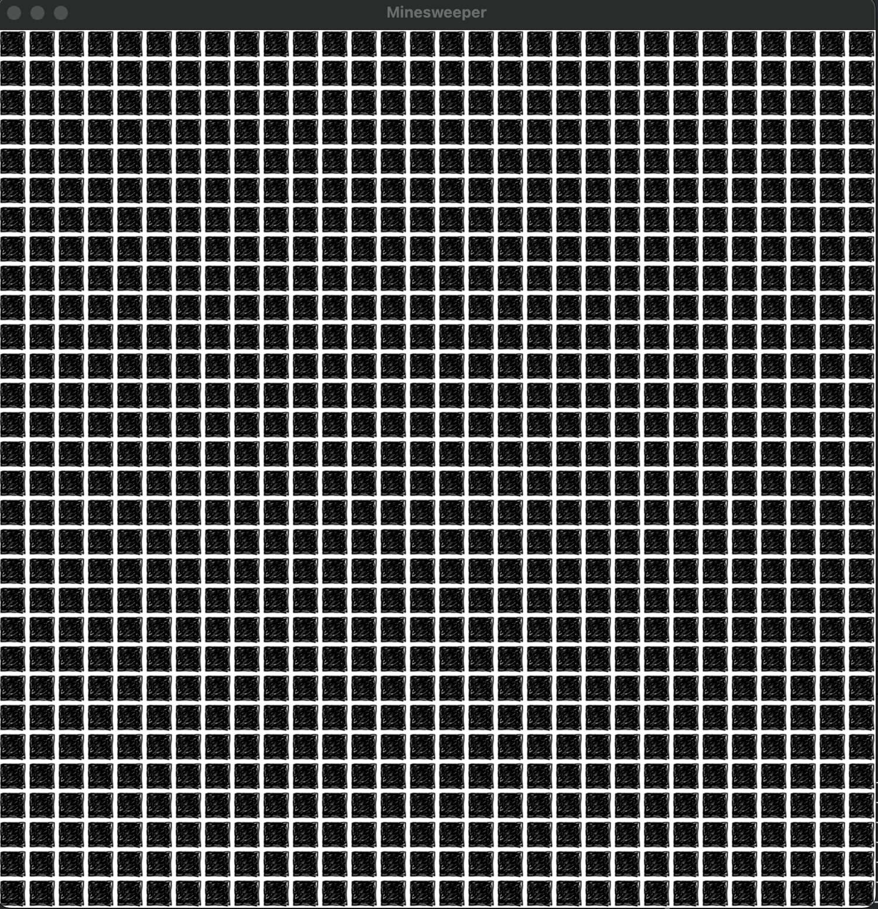
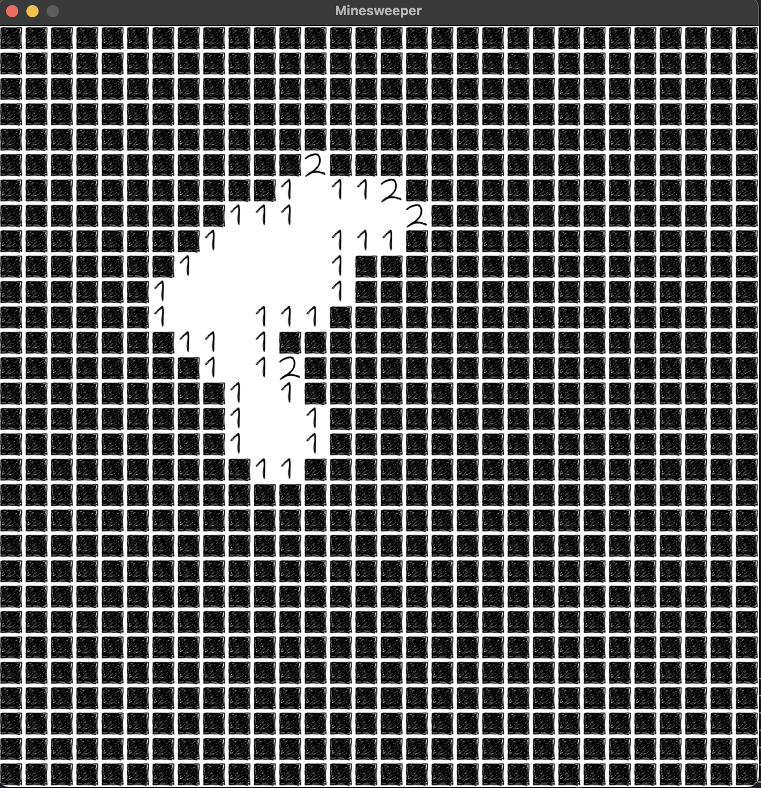
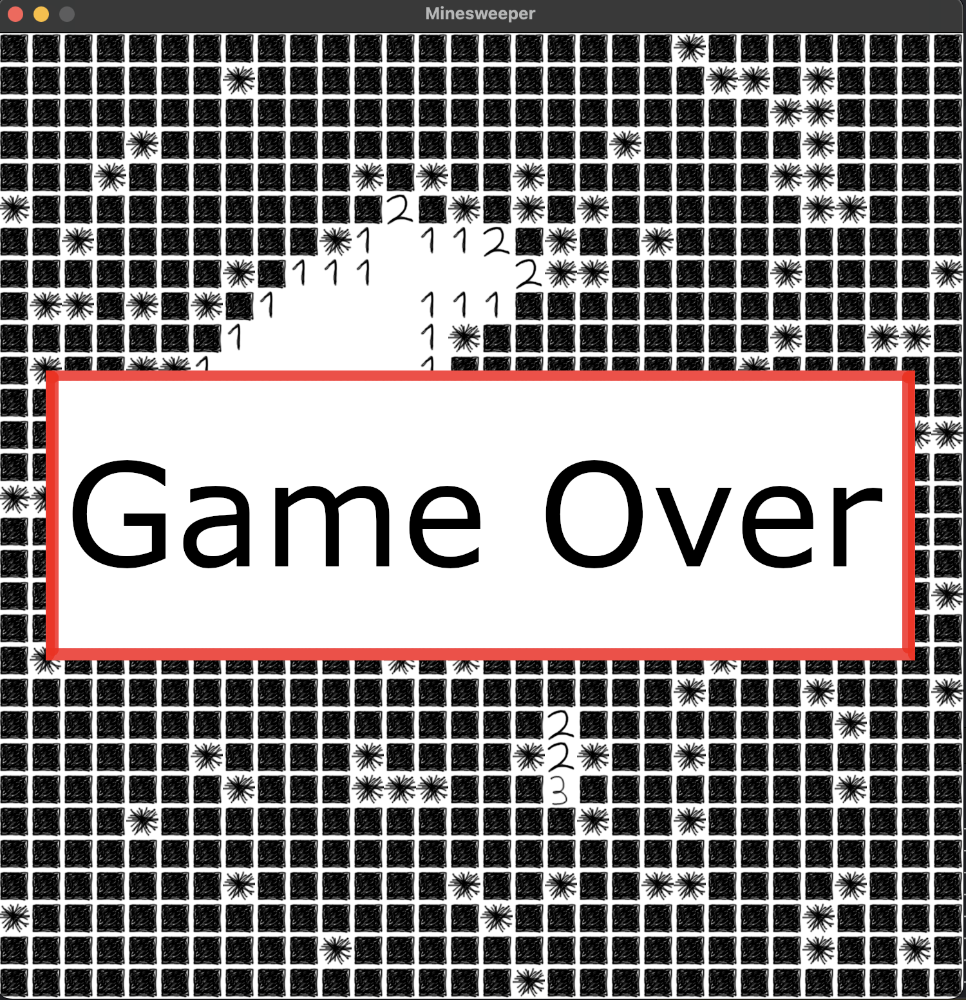

# Minesweeper

Minesweeper is a classic game where you click open tiles on a grid with hidden mines, aim being to clear
the whole area without hitting a mine. This is an implementation in object oriented C++ using SDL2 media layer.

The project implements graphics, input handling, and game logic. Game logic uses a flood fill based algirithm
for path searching and mine detection.

## Screenshots

	
	
	

